# 3. System Architecture

## 3.1 Overview

NexusGen employs a distributed microservices architecture designed for scalability, fault tolerance, and autonomous operation. The system leverages event-driven communication patterns to coordinate AI agents that autonomously design, code, build, test, and deploy web applications.

### Core Architectural Principles

- **Autonomous Operation**: AI agents operate independently with self-healing capabilities
- **Event-Driven Design**: Loose coupling through asynchronous message passing
- **Fault Tolerance**: Graceful degradation with comprehensive retry mechanisms
- **Horizontal Scalability**: Stateless services that scale independently
- **Observability**: Comprehensive logging, tracing, and metrics at every layer

---

## 3.2 High-Level Microservices Architecture

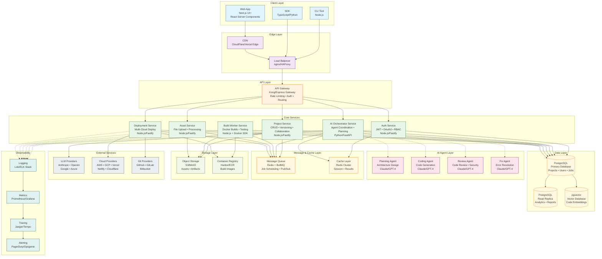

### Service Descriptions

| Service | Responsibility | Technology Stack | Scaling Strategy |
|---------|---------------|------------------|------------------|
| **API Gateway** | Request routing, rate limiting, authentication | Kong/Express Gateway | Horizontal with sticky sessions |
| **Auth Service** | User authentication, JWT tokens, RBAC | Node.js, Fastify, Passport | Horizontal, stateless |
| **Project Service** | Project CRUD, versioning, collaboration | Node.js, Fastify, Prisma | Horizontal with DB sharding |
| **AI Orchestrator** | Agent coordination, task planning | Python, FastAPI, LangChain | Horizontal with job affinity |
| **Build Worker** | Docker builds, test execution | Node.js, Docker SDK, BuildKit | Auto-scaling worker pool |
| **Asset Service** | File upload, image processing | Node.js, Sharp, FFmpeg | Horizontal with CDN |
| **Deployment Service** | Multi-cloud deployment orchestration | Node.js, Pulumi/Terraform | Horizontal, region-aware |

---

## 3.3 The Agentic Loop Flow

The Agentic Loop is the core autonomous workflow that transforms user prompts into deployed web applications. This self-correcting loop enables NexusGen to iteratively improve generated code until it successfully builds and deploys.

```mermaid
flowchart TB
    subgraph Input Phase
        START((Start)) --> PROMPT[/User Prompt<br/>+ Context/]
        PROMPT --> VALIDATE{Validate<br/>Input?}
        VALIDATE -->|Invalid| ERROR_INPUT[Return<br/>Validation Error]
        ERROR_INPUT --> END_FAIL((End))
        VALIDATE -->|Valid| ENRICH[Enrich Prompt<br/>Add Context • History]
    end

    subgraph Planning Phase
        ENRICH --> PLAN_AGENT[Planning Agent<br/>Analyze Requirements]
        PLAN_AGENT --> ARCH_DESIGN[Generate<br/>Architecture Plan]
        ARCH_DESIGN --> TECH_SELECT[Select<br/>Tech Stack]
        TECH_SELECT --> TASK_DECOMP[Decompose into<br/>Coding Tasks]
        TASK_DECOMP --> PLAN_REVIEW{Plan<br/>Review?}
        PLAN_REVIEW -->|Rejected| PLAN_AGENT
        PLAN_REVIEW -->|Approved| QUEUE_TASKS[Queue Tasks<br/>to BullMQ]
    end

    subgraph Coding Phase
        QUEUE_TASKS --> CODE_AGENT[Coding Agent<br/>Generate Code]
        CODE_AGENT --> LINT_CHECK[Static Analysis<br/>ESLint • TypeScript]
        LINT_CHECK --> LINT_PASS{Lint<br/>Pass?}
        LINT_PASS -->|No| LINT_FIX[Auto-Fix<br/>Lint Issues]
        LINT_FIX --> LINT_CHECK
        LINT_PASS -->|Yes| SECURITY_SCAN[Security Scan<br/>Snyk • CodeQL]
        SECURITY_SCAN --> SEC_PASS{Security<br/>Pass?}
        SEC_PASS -->|Critical| SEC_FIX[Security<br/>Fix Agent]
        SEC_FIX --> CODE_AGENT
        SEC_PASS -->|Pass/Warn| COMMIT_CODE[Commit to<br/>Git Branch]
    end

    subgraph Build Phase
        COMMIT_CODE --> BUILD_START[Start Docker<br/>Build]
        BUILD_START --> BUILD_EXEC[Execute<br/>Build Steps]
        BUILD_EXEC --> CAPTURE_OUTPUT[Capture stdout<br/>stderr • exit code]
        CAPTURE_OUTPUT --> BUILD_SUCCESS{Build<br/>Success?}
    end

    subgraph Error Detection & Classification
        BUILD_SUCCESS -->|No| PARSE_ERROR[Parse Error<br/>Output]
        PARSE_ERROR --> CLASSIFY[Classify<br/>Error Type]
        CLASSIFY --> ERROR_TYPE{Error<br/>Type?}

        ERROR_TYPE -->|Dependency| DEP_ERROR[Dependency<br/>Resolution Error]
        ERROR_TYPE -->|Syntax| SYNTAX_ERROR[Syntax/Type<br/>Error]
        ERROR_TYPE -->|Runtime| RUNTIME_ERROR[Runtime<br/>Configuration]
        ERROR_TYPE -->|Resource| RESOURCE_ERROR[Resource<br/>Limit Error]
        ERROR_TYPE -->|Unknown| UNKNOWN_ERROR[Unknown<br/>Error]
    end

    subgraph Self-Healing Phase
        DEP_ERROR --> CHECK_CACHE{Fix in<br/>Cache?}
        SYNTAX_ERROR --> CHECK_CACHE
        RUNTIME_ERROR --> CHECK_CACHE
        RESOURCE_ERROR --> SCALE_RESOURCES[Scale<br/>Resources]
        UNKNOWN_ERROR --> HUMAN_ESCALATE[Escalate to<br/>Human Review]

        CHECK_CACHE -->|Yes| APPLY_CACHED[Apply Cached<br/>Fix]
        CHECK_CACHE -->|No| FIX_AGENT[Fix Agent<br/>Analyze Error]

        FIX_AGENT --> GENERATE_FIX[Generate<br/>Fix Proposal]
        GENERATE_FIX --> APPLY_FIX[Apply Fix<br/>to Code]
        APPLY_CACHED --> APPLY_FIX

        APPLY_FIX --> INCREMENT_RETRY[Increment<br/>Retry Counter]
        SCALE_RESOURCES --> INCREMENT_RETRY

        INCREMENT_RETRY --> CHECK_RETRY{Retry<br/>< Max?}
        CHECK_RETRY -->|Yes| BACKOFF[Exponential<br/>Backoff Wait]
        BACKOFF --> CODE_AGENT
        CHECK_RETRY -->|No| FALLBACK{Fallback<br/>Available?}
        FALLBACK -->|Yes| USE_FALLBACK[Use Fallback<br/>Strategy]
        USE_FALLBACK --> BUILD_START
        FALLBACK -->|No| HUMAN_ESCALATE
    end

    subgraph Test Phase
        BUILD_SUCCESS -->|Yes| RUN_TESTS[Run Test<br/>Suite]
        RUN_TESTS --> TEST_PASS{Tests<br/>Pass?}
        TEST_PASS -->|No| PARSE_ERROR
        TEST_PASS -->|Yes| CACHE_SUCCESS[Cache Successful<br/>Patterns]
    end

    subgraph Deploy Phase
        CACHE_SUCCESS --> DEPLOY_PREVIEW[Deploy to<br/>Preview Environment]
        DEPLOY_PREVIEW --> HEALTH_CHECK{Health<br/>Check OK?}
        HEALTH_CHECK -->|No| PARSE_ERROR
        HEALTH_CHECK -->|Yes| NOTIFY_USER[Notify User<br/>Preview Ready]
        NOTIFY_USER --> USER_APPROVE{User<br/>Approves?}
        USER_APPROVE -->|No| PROMPT
        USER_APPROVE -->|Yes| DEPLOY_PROD[Deploy to<br/>Production]
        DEPLOY_PROD --> END_SUCCESS((Success))
    end

    HUMAN_ESCALATE --> END_ESCALATE((Escalated))

    classDef input fill:#e3f2fd,stroke:#1565c0
    classDef plan fill:#f3e5f5,stroke:#7b1fa2
    classDef code fill:#e8f5e9,stroke:#2e7d32
    classDef build fill:#fff3e0,stroke:#ef6c00
    classDef error fill:#ffebee,stroke:#c62828
    classDef heal fill:#fce4ec,stroke:#ad1457
    classDef test fill:#e0f7fa,stroke:#00838f
    classDef deploy fill:#f1f8e9,stroke:#558b2f
    classDef endpoint fill:#37474f,stroke:#263238,color:#fff

    class PROMPT,VALIDATE,ERROR_INPUT,ENRICH input
    class PLAN_AGENT,ARCH_DESIGN,TECH_SELECT,TASK_DECOMP,PLAN_REVIEW,QUEUE_TASKS plan
    class CODE_AGENT,LINT_CHECK,LINT_PASS,LINT_FIX,SECURITY_SCAN,SEC_PASS,SEC_FIX,COMMIT_CODE code
    class BUILD_START,BUILD_EXEC,CAPTURE_OUTPUT,BUILD_SUCCESS build
    class PARSE_ERROR,CLASSIFY,ERROR_TYPE,DEP_ERROR,SYNTAX_ERROR,RUNTIME_ERROR,RESOURCE_ERROR,UNKNOWN_ERROR error
    class CHECK_CACHE,APPLY_CACHED,FIX_AGENT,GENERATE_FIX,APPLY_FIX,INCREMENT_RETRY,CHECK_RETRY,BACKOFF,FALLBACK,USE_FALLBACK,SCALE_RESOURCES,HUMAN_ESCALATE heal
    class RUN_TESTS,TEST_PASS,CACHE_SUCCESS test
    class DEPLOY_PREVIEW,HEALTH_CHECK,NOTIFY_USER,USER_APPROVE,DEPLOY_PROD deploy
    class START,END_SUCCESS,END_FAIL,END_ESCALATE endpoint
```

### Agentic Loop State Machine

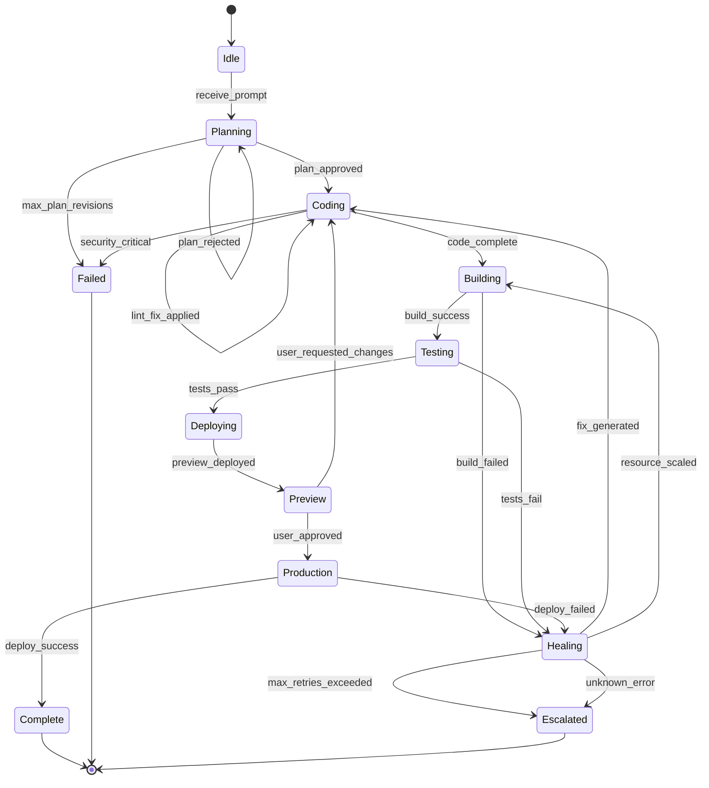

---

## 3.4 Self-Healing Mechanism

The self-healing mechanism is NexusGen's core capability for autonomous error recovery. It captures, classifies, and resolves build and runtime errors without human intervention.

### 3.4.1 Error Capture System

#### Docker Build Output Capture

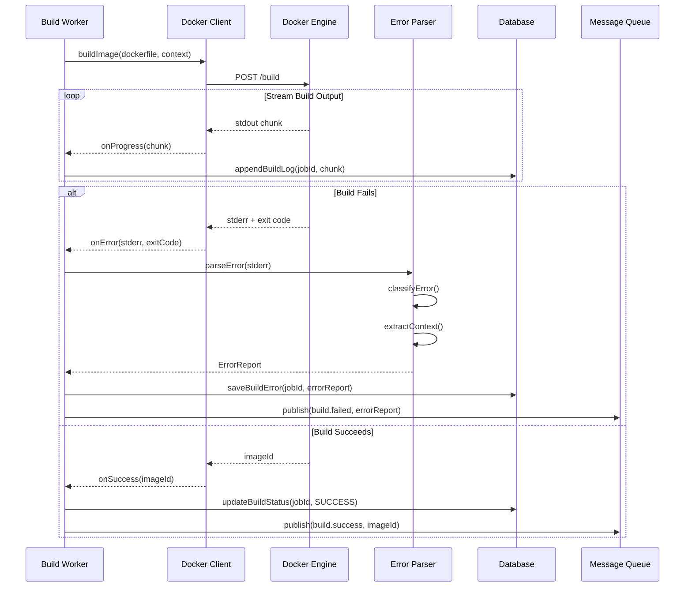

#### stderr Capture Implementation

```typescript
interface BuildOutputStream {
  stdout: string[];
  stderr: string[];
  exitCode: number | null;
  timestamps: { start: Date; end: Date };
  resourceUsage: {
    peakMemoryMB: number;
    cpuSeconds: number;
    networkBytes: number;
  };
}

interface DockerBuildOptions {
  dockerfile: string;
  context: string;
  buildArgs: Record<string, string>;
  target?: string;
  platform?: string;
  timeout: number; // milliseconds
  memoryLimit: string; // e.g., "4g"
  cpuLimit: number; // CPU cores
}

class BuildOutputCapture {
  private buffer: BuildOutputStream = {
    stdout: [],
    stderr: [],
    exitCode: null,
    timestamps: { start: new Date(), end: new Date() },
    resourceUsage: { peakMemoryMB: 0, cpuSeconds: 0, networkBytes: 0 }
  };

  async captureDockerBuild(options: DockerBuildOptions): Promise<BuildOutputStream> {
    const docker = new Docker();

    this.buffer.timestamps.start = new Date();

    try {
      const stream = await docker.buildImage({
        context: options.context,
        src: [options.dockerfile, '.'],
      }, {
        t: `nexusgen-build:${Date.now()}`,
        buildargs: options.buildArgs,
        target: options.target,
        platform: options.platform,
        memory: this.parseMemoryLimit(options.memoryLimit),
        cpuquota: options.cpuLimit * 100000,
      });

      await new Promise((resolve, reject) => {
        docker.modem.followProgress(
          stream,
          (err, output) => {
            this.buffer.timestamps.end = new Date();
            if (err) {
              this.buffer.exitCode = 1;
              this.buffer.stderr.push(err.message);
              reject(err);
            } else {
              this.buffer.exitCode = 0;
              resolve(output);
            }
          },
          (event) => this.processStreamEvent(event)
        );

        // Timeout handler
        setTimeout(() => {
          reject(new Error(`Build timeout after ${options.timeout}ms`));
        }, options.timeout);
      });

    } catch (error) {
      this.buffer.stderr.push(this.extractErrorMessage(error));
      this.buffer.exitCode = this.buffer.exitCode ?? 1;
    }

    return this.buffer;
  }

  private processStreamEvent(event: any): void {
    if (event.stream) {
      this.buffer.stdout.push(event.stream.trim());
    }
    if (event.error) {
      this.buffer.stderr.push(event.error);
    }
    if (event.errorDetail) {
      this.buffer.stderr.push(JSON.stringify(event.errorDetail));
    }
    // Capture step-specific errors
    if (event.status === 'error') {
      this.buffer.stderr.push(event.progress || event.status);
    }
  }
}
```

### 3.4.2 Error Parsing and Classification System

#### Error Classification Taxonomy

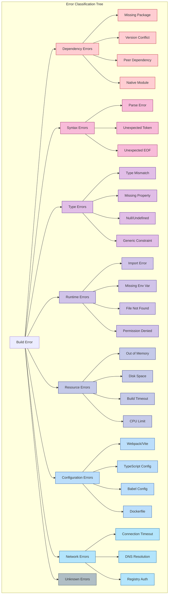

#### Error Parser Implementation

```typescript
interface ParsedError {
  id: string;
  category: ErrorCategory;
  subcategory: string;
  severity: 'critical' | 'error' | 'warning';
  message: string;
  file?: string;
  line?: number;
  column?: number;
  codeSnippet?: string;
  stackTrace?: string[];
  suggestions: string[];
  relatedDocs: string[];
  confidence: number; // 0-1 classification confidence
}

enum ErrorCategory {
  DEPENDENCY = 'dependency',
  SYNTAX = 'syntax',
  TYPE = 'type',
  RUNTIME = 'runtime',
  RESOURCE = 'resource',
  CONFIGURATION = 'configuration',
  NETWORK = 'network',
  UNKNOWN = 'unknown'
}

class ErrorParser {
  private patterns: Map<ErrorCategory, RegExp[]> = new Map([
    [ErrorCategory.DEPENDENCY, [
      /Cannot find module ['"]([^'"]+)['"]/,
      /Module not found: Error: Can't resolve ['"]([^'"]+)['"]/,
      /npm ERR! peer dep missing: ([^,]+)/,
      /ERESOLVE unable to resolve dependency tree/,
      /node-gyp rebuild failed/,
      /Could not resolve dependency/,
      /ENOENT: no such file or directory.*node_modules/,
    ]],
    [ErrorCategory.SYNTAX, [
      /SyntaxError: (.+) at line (\d+)/,
      /Unexpected token (.+)/,
      /Parsing error: (.+)/,
      /error: Expected (.+) but found (.+)/,
    ]],
    [ErrorCategory.TYPE, [
      /Type ['"]([^'"]+)['"] is not assignable to type ['"]([^'"]+)['"]/,
      /Property ['"]([^'"]+)['"] does not exist on type ['"]([^'"]+)['"]/,
      /Cannot read propert(y|ies) of (undefined|null)/,
      /TS\d+: (.+)/,
      /Argument of type ['"]([^'"]+)['"] is not assignable/,
    ]],
    [ErrorCategory.RUNTIME, [
      /Error: Cannot find module ['"]([^'"]+)['"]/,
      /ReferenceError: (.+) is not defined/,
      /Error: ENOENT: no such file or directory/,
      /EACCES: permission denied/,
      /Missing required environment variable: (\w+)/,
    ]],
    [ErrorCategory.RESOURCE, [
      /FATAL ERROR: (.+) JavaScript heap out of memory/,
      /ENOMEM/,
      /ENOSPC: no space left on device/,
      /Build killed - out of memory/,
      /error: timeout/i,
    ]],
    [ErrorCategory.CONFIGURATION, [
      /Invalid configuration object/,
      /Configuration error:/,
      /Error in (.+\.config\.(js|ts|json))/,
      /tsconfig\.json.*error/i,
    ]],
    [ErrorCategory.NETWORK, [
      /ETIMEDOUT/,
      /ECONNREFUSED/,
      /EAI_AGAIN/,
      /npm ERR! network/,
      /getaddrinfo ENOTFOUND/,
      /401 Unauthorized/,
      /403 Forbidden/,
    ]],
  ]);

  parse(stderr: string[], stdout: string[]): ParsedError[] {
    const errors: ParsedError[] = [];
    const combinedOutput = [...stderr, ...stdout].join('\n');

    for (const [category, patterns] of this.patterns) {
      for (const pattern of patterns) {
        const matches = combinedOutput.matchAll(new RegExp(pattern, 'gm'));
        for (const match of matches) {
          const error = this.buildParsedError(category, match, combinedOutput);
          errors.push(error);
        }
      }
    }

    // Deduplicate and sort by severity
    return this.deduplicateAndRank(errors);
  }

  private buildParsedError(
    category: ErrorCategory,
    match: RegExpMatchArray,
    fullOutput: string
  ): ParsedError {
    const error: ParsedError = {
      id: this.generateErrorId(category, match[0]),
      category,
      subcategory: this.determineSubcategory(category, match[0]),
      severity: this.determineSeverity(category),
      message: match[0],
      confidence: this.calculateConfidence(category, match),
      suggestions: this.generateSuggestions(category, match),
      relatedDocs: this.findRelatedDocs(category, match),
    };

    // Extract file location if present
    const locationMatch = fullOutput.match(
      new RegExp(`${escapeRegex(match[0])}[\\s\\S]{0,200}?(\\S+\\.(ts|tsx|js|jsx)):(\\d+)(?::(\\d+))?`)
    );
    if (locationMatch) {
      error.file = locationMatch[1];
      error.line = parseInt(locationMatch[3], 10);
      error.column = locationMatch[4] ? parseInt(locationMatch[4], 10) : undefined;
    }

    // Extract code snippet context
    error.codeSnippet = this.extractCodeSnippet(fullOutput, match.index || 0);

    // Extract stack trace if present
    error.stackTrace = this.extractStackTrace(fullOutput, match.index || 0);

    return error;
  }

  private generateSuggestions(category: ErrorCategory, match: RegExpMatchArray): string[] {
    const suggestions: string[] = [];

    switch (category) {
      case ErrorCategory.DEPENDENCY:
        if (match[0].includes('Cannot find module')) {
          const moduleName = match[1];
          suggestions.push(`Install missing package: npm install ${moduleName}`);
          suggestions.push(`Check if package name is spelled correctly`);
          suggestions.push(`Verify the import path is correct`);
        }
        if (match[0].includes('peer dep')) {
          suggestions.push(`Install peer dependency manually`);
          suggestions.push(`Use --legacy-peer-deps flag`);
        }
        break;

      case ErrorCategory.TYPE:
        suggestions.push(`Check type definitions are up to date`);
        suggestions.push(`Verify @types packages are installed`);
        suggestions.push(`Consider using type assertion if intentional`);
        break;

      case ErrorCategory.RESOURCE:
        suggestions.push(`Increase Node.js memory limit: NODE_OPTIONS=--max-old-space-size=4096`);
        suggestions.push(`Clean node_modules and reinstall`);
        suggestions.push(`Check for memory leaks in build process`);
        break;
    }

    return suggestions;
  }
}
```

### 3.4.3 LLM Error Context Injection

The Fix Agent receives structured error context to generate targeted fixes.

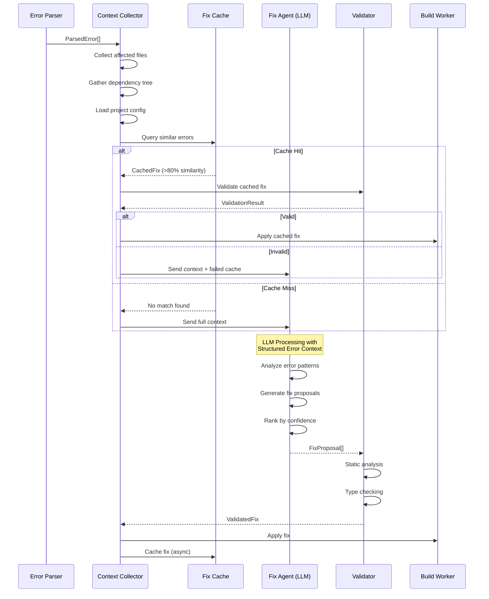

#### Error Context Structure for LLM

```typescript
interface LLMErrorContext {
  // Error details
  error: {
    category: ErrorCategory;
    message: string;
    file?: string;
    line?: number;
    column?: number;
    stackTrace?: string[];
  };

  // Affected code context
  codeContext: {
    affectedFile: {
      path: string;
      content: string;
      language: string;
    };
    surroundingFiles: Array<{
      path: string;
      content: string;
      relevance: number; // 0-1 relevance score
    }>;
    lineRange: {
      start: number;
      end: number;
      highlightedContent: string;
    };
  };

  // Project context
  projectContext: {
    framework: string; // 'next.js', 'react', 'vue', etc.
    packageJson: object;
    tsConfig?: object;
    dependencies: Record<string, string>;
    devDependencies: Record<string, string>;
  };

  // Build context
  buildContext: {
    dockerfile: string;
    buildArgs: Record<string, string>;
    previousAttempts: Array<{
      timestamp: Date;
      error: string;
      attemptedFix: string;
      result: 'success' | 'failure';
    }>;
  };

  // Historical context
  historicalContext: {
    similarErrorsResolved: Array<{
      error: string;
      fix: string;
      similarity: number;
      successRate: number;
    }>;
  };

  // Instructions for LLM
  instructions: {
    outputFormat: 'json';
    requiredFields: string[];
    constraints: string[];
  };
}

// Example prompt construction
function buildFixPrompt(context: LLMErrorContext): string {
  return `
You are a Senior Software Engineer fixing a build error in a ${context.projectContext.framework} project.

## Error Details
**Category:** ${context.error.category}
**Message:** ${context.error.message}
**File:** ${context.error.file || 'Unknown'}
**Line:** ${context.error.line || 'Unknown'}

## Stack Trace
\`\`\`
${context.error.stackTrace?.join('\n') || 'No stack trace available'}
\`\`\`

## Affected Code
**File:** ${context.codeContext.affectedFile.path}
\`\`\`${context.codeContext.affectedFile.language}
${context.codeContext.lineRange.highlightedContent}
\`\`\`

## Related Files
${context.codeContext.surroundingFiles.map(f => `
**${f.path}** (relevance: ${(f.relevance * 100).toFixed(0)}%)
\`\`\`
${f.content.slice(0, 500)}${f.content.length > 500 ? '...' : ''}
\`\`\`
`).join('\n')}

## Project Dependencies
\`\`\`json
${JSON.stringify(context.projectContext.dependencies, null, 2)}
\`\`\`

## Previous Fix Attempts (that failed)
${context.buildContext.previousAttempts.filter(a => a.result === 'failure').map(a => `
- **Attempted:** ${a.attemptedFix}
  **Result:** ${a.error}
`).join('\n')}

## Similar Errors Successfully Fixed
${context.historicalContext.similarErrorsResolved.slice(0, 3).map(h => `
- **Error:** ${h.error.slice(0, 100)}...
  **Fix:** ${h.fix.slice(0, 200)}...
  **Success Rate:** ${(h.successRate * 100).toFixed(0)}%
`).join('\n')}

## Instructions
Generate a fix for this error. Return a JSON object with:
1. \`analysis\`: Brief explanation of the root cause
2. \`fixes\`: Array of file modifications needed
3. \`confidence\`: Your confidence level (0-1)
4. \`alternativeFixes\`: Alternative approaches if primary fails

Return ONLY valid JSON, no markdown code blocks.
`;
}
```

### 3.4.4 Retry Logic with Exponential Backoff

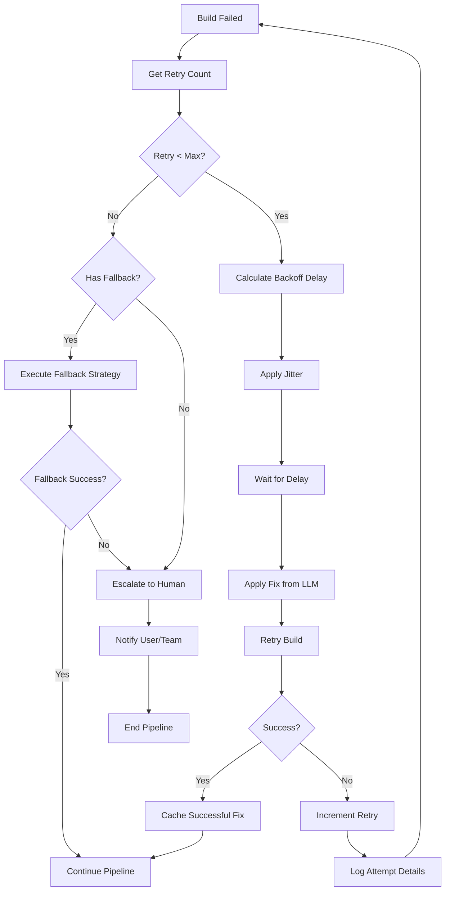

#### Retry Configuration and Implementation

```typescript
interface RetryConfig {
  maxRetries: number;              // Default: 5
  baseDelayMs: number;             // Default: 1000
  maxDelayMs: number;              // Default: 60000
  exponentialBase: number;         // Default: 2
  jitterFactor: number;            // Default: 0.1 (10% jitter)
  retryableCategories: ErrorCategory[];
  categorySpecificLimits: Partial<Record<ErrorCategory, number>>;
}

const DEFAULT_RETRY_CONFIG: RetryConfig = {
  maxRetries: 5,
  baseDelayMs: 1000,
  maxDelayMs: 60000,
  exponentialBase: 2,
  jitterFactor: 0.1,
  retryableCategories: [
    ErrorCategory.DEPENDENCY,
    ErrorCategory.SYNTAX,
    ErrorCategory.TYPE,
    ErrorCategory.RUNTIME,
    ErrorCategory.CONFIGURATION,
  ],
  categorySpecificLimits: {
    [ErrorCategory.DEPENDENCY]: 3,    // Fewer retries for deps
    [ErrorCategory.RESOURCE]: 2,      // Resource issues rarely self-fix
    [ErrorCategory.NETWORK]: 5,       // Network can be transient
    [ErrorCategory.UNKNOWN]: 2,       // Don't spin on unknowns
  },
};

class RetryManager {
  private config: RetryConfig;
  private attemptHistory: Map<string, AttemptRecord[]> = new Map();

  constructor(config: Partial<RetryConfig> = {}) {
    this.config = { ...DEFAULT_RETRY_CONFIG, ...config };
  }

  async executeWithRetry<T>(
    jobId: string,
    operation: () => Promise<T>,
    errorHandler: (error: ParsedError) => Promise<void>
  ): Promise<T> {
    let lastError: ParsedError | null = null;
    let attempts = 0;

    while (attempts < this.config.maxRetries) {
      try {
        const result = await operation();

        // Success - cache the successful path
        if (lastError) {
          await this.cacheSuccessfulFix(jobId, lastError, attempts);
        }

        return result;
      } catch (error) {
        const parsedError = error as ParsedError;
        lastError = parsedError;
        attempts++;

        // Check if error is retryable
        if (!this.isRetryable(parsedError, attempts)) {
          throw this.createNonRetryableError(parsedError, attempts);
        }

        // Log attempt
        this.recordAttempt(jobId, parsedError, attempts);

        // Calculate delay with exponential backoff + jitter
        const delay = this.calculateDelay(attempts, parsedError.category);

        console.log(`[Retry ${attempts}/${this.config.maxRetries}] ` +
          `Waiting ${delay}ms before retry. Error: ${parsedError.message}`);

        await this.sleep(delay);

        // Execute error handler (apply fix from LLM)
        await errorHandler(parsedError);
      }
    }

    throw new MaxRetriesExceededError(jobId, attempts, lastError!);
  }

  private calculateDelay(attempt: number, category: ErrorCategory): number {
    // Base exponential backoff
    const exponentialDelay = this.config.baseDelayMs *
      Math.pow(this.config.exponentialBase, attempt - 1);

    // Cap at maximum
    const cappedDelay = Math.min(exponentialDelay, this.config.maxDelayMs);

    // Add jitter (-jitterFactor to +jitterFactor)
    const jitterRange = cappedDelay * this.config.jitterFactor;
    const jitter = (Math.random() * 2 - 1) * jitterRange;

    // Category-specific adjustments
    const categoryMultiplier = this.getCategoryDelayMultiplier(category);

    return Math.floor((cappedDelay + jitter) * categoryMultiplier);
  }

  private getCategoryDelayMultiplier(category: ErrorCategory): number {
    // Network errors benefit from longer waits
    if (category === ErrorCategory.NETWORK) return 1.5;
    // Resource errors need time for cleanup
    if (category === ErrorCategory.RESOURCE) return 2.0;
    // Syntax/type errors can retry quickly
    if (category === ErrorCategory.SYNTAX || category === ErrorCategory.TYPE) return 0.5;
    return 1.0;
  }

  private isRetryable(error: ParsedError, currentAttempt: number): boolean {
    // Check if category is retryable
    if (!this.config.retryableCategories.includes(error.category)) {
      return false;
    }

    // Check category-specific limits
    const categoryLimit = this.config.categorySpecificLimits[error.category];
    if (categoryLimit && currentAttempt >= categoryLimit) {
      return false;
    }

    // Check for known non-retryable patterns
    const nonRetryablePatterns = [
      /license key/i,
      /authentication required/i,
      /subscription expired/i,
      /quota exceeded/i,
    ];

    return !nonRetryablePatterns.some(p => p.test(error.message));
  }

  private recordAttempt(jobId: string, error: ParsedError, attempt: number): void {
    const record: AttemptRecord = {
      timestamp: new Date(),
      attempt,
      error: error.message,
      category: error.category,
      file: error.file,
    };

    const history = this.attemptHistory.get(jobId) || [];
    history.push(record);
    this.attemptHistory.set(jobId, history);
  }
}
```

### 3.4.5 Fallback Strategies

```typescript
interface FallbackStrategy {
  name: string;
  applicableCategories: ErrorCategory[];
  priority: number; // Lower = higher priority
  execute: (context: ErrorContext) => Promise<FallbackResult>;
}

const FALLBACK_STRATEGIES: FallbackStrategy[] = [
  {
    name: 'dependency_lockfile_regeneration',
    applicableCategories: [ErrorCategory.DEPENDENCY],
    priority: 1,
    async execute(context) {
      // Delete lockfile and node_modules, reinstall
      await fs.rm(path.join(context.projectPath, 'node_modules'), { recursive: true, force: true });
      await fs.rm(path.join(context.projectPath, 'package-lock.json'), { force: true });
      await execAsync('npm install', { cwd: context.projectPath });
      return { success: true, action: 'regenerated_lockfile' };
    }
  },
  {
    name: 'alternative_package_manager',
    applicableCategories: [ErrorCategory.DEPENDENCY],
    priority: 2,
    async execute(context) {
      // Try with different package manager (pnpm, yarn)
      if (context.currentPackageManager === 'npm') {
        await execAsync('pnpm install', { cwd: context.projectPath });
        return { success: true, action: 'switched_to_pnpm' };
      }
      return { success: false, reason: 'no_alternative_available' };
    }
  },
  {
    name: 'simplified_dockerfile',
    applicableCategories: [ErrorCategory.CONFIGURATION, ErrorCategory.RESOURCE],
    priority: 3,
    async execute(context) {
      // Use a known-working simplified Dockerfile template
      const simplifiedDockerfile = generateSimplifiedDockerfile(context.framework);
      await fs.writeFile(
        path.join(context.projectPath, 'Dockerfile'),
        simplifiedDockerfile
      );
      return { success: true, action: 'used_simplified_dockerfile' };
    }
  },
  {
    name: 'resource_scaling',
    applicableCategories: [ErrorCategory.RESOURCE],
    priority: 1,
    async execute(context) {
      // Request higher resource limits
      const newConfig = {
        memory: context.currentResources.memory * 2,
        cpu: context.currentResources.cpu * 1.5,
      };
      await context.updateBuildResources(newConfig);
      return { success: true, action: 'scaled_resources', newConfig };
    }
  },
  {
    name: 'previous_successful_build',
    applicableCategories: [ErrorCategory.UNKNOWN],
    priority: 4,
    async execute(context) {
      // Revert to last known successful state
      const lastSuccessfulCommit = await context.getLastSuccessfulBuild();
      if (lastSuccessfulCommit) {
        await execAsync(`git checkout ${lastSuccessfulCommit}`, { cwd: context.projectPath });
        return { success: true, action: 'reverted_to_successful_commit', commit: lastSuccessfulCommit };
      }
      return { success: false, reason: 'no_successful_build_found' };
    }
  },
  {
    name: 'human_escalation',
    applicableCategories: Object.values(ErrorCategory),
    priority: 100, // Last resort
    async execute(context) {
      await context.notifyHuman({
        type: 'build_failure_escalation',
        jobId: context.jobId,
        attempts: context.attemptHistory,
        lastError: context.lastError,
      });
      return { success: false, reason: 'escalated_to_human' };
    }
  }
];
```

### 3.4.6 Fix Caching and Learning System

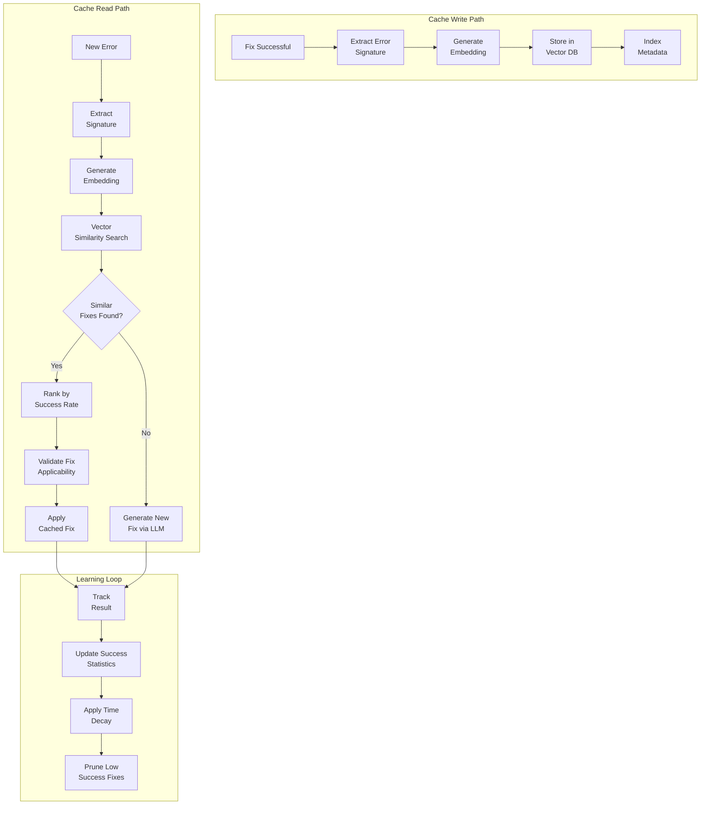

#### Fix Cache Implementation

```typescript
interface CachedFix {
  id: string;
  errorSignature: ErrorSignature;
  embedding: number[];  // Vector embedding for similarity search
  fix: FixDetails;
  metadata: {
    createdAt: Date;
    lastUsed: Date;
    useCount: number;
    successCount: number;
    failureCount: number;
    successRate: number;
    avgTimeToFix: number;
  };
  context: {
    framework: string;
    nodeVersion: string;
    dependencies: Record<string, string>;
  };
}

interface ErrorSignature {
  category: ErrorCategory;
  subcategory: string;
  messageHash: string;  // Normalized message hash
  filePattern?: string; // e.g., "*.tsx", "package.json"
  frameSignature?: string; // First N stack frames hashed
}

class FixCache {
  private vectorDb: PgVectorClient;
  private metadataDb: PrismaClient;
  private embeddingModel: EmbeddingModel;

  private readonly SIMILARITY_THRESHOLD = 0.85;
  private readonly MIN_SUCCESS_RATE = 0.6;
  private readonly CACHE_TTL_DAYS = 90;

  async findSimilarFix(error: ParsedError, context: ProjectContext): Promise<CachedFix | null> {
    // Generate error embedding
    const errorText = this.normalizeErrorForEmbedding(error);
    const embedding = await this.embeddingModel.embed(errorText);

    // Search vector database
    const candidates = await this.vectorDb.query({
      vector: embedding,
      topK: 10,
      filter: {
        category: error.category,
        framework: context.framework,
      },
      threshold: this.SIMILARITY_THRESHOLD,
    });

    if (candidates.length === 0) {
      return null;
    }

    // Rank candidates by composite score
    const rankedCandidates = candidates
      .map(c => ({
        ...c,
        score: this.calculateCompositeScore(c, error, context),
      }))
      .filter(c => c.metadata.successRate >= this.MIN_SUCCESS_RATE)
      .sort((a, b) => b.score - a.score);

    if (rankedCandidates.length === 0) {
      return null;
    }

    const bestMatch = rankedCandidates[0];

    // Validate fix is applicable to current context
    const isApplicable = await this.validateFixApplicability(bestMatch, context);

    return isApplicable ? bestMatch : null;
  }

  private calculateCompositeScore(
    cached: CachedFix,
    error: ParsedError,
    context: ProjectContext
  ): number {
    // Weights for different factors
    const weights = {
      similarity: 0.3,
      successRate: 0.25,
      recency: 0.15,
      useCount: 0.1,
      contextMatch: 0.2,
    };

    // Similarity score (already from vector search)
    const similarity = cached.similarity;

    // Success rate
    const successRate = cached.metadata.successRate;

    // Recency (exponential decay over 30 days)
    const daysSinceUse = (Date.now() - cached.metadata.lastUsed.getTime()) / (1000 * 60 * 60 * 24);
    const recency = Math.exp(-daysSinceUse / 30);

    // Use count (log scale to prevent domination by popular fixes)
    const useCount = Math.log10(cached.metadata.useCount + 1) / 3; // Normalize to ~0-1

    // Context match (framework, dependency versions)
    const contextMatch = this.calculateContextMatch(cached.context, context);

    return (
      weights.similarity * similarity +
      weights.successRate * successRate +
      weights.recency * recency +
      weights.useCount * useCount +
      weights.contextMatch * contextMatch
    );
  }

  async cacheFix(error: ParsedError, fix: FixDetails, context: ProjectContext): Promise<void> {
    const signature = this.generateErrorSignature(error);
    const errorText = this.normalizeErrorForEmbedding(error);
    const embedding = await this.embeddingModel.embed(errorText);

    const cachedFix: CachedFix = {
      id: uuidv4(),
      errorSignature: signature,
      embedding,
      fix,
      metadata: {
        createdAt: new Date(),
        lastUsed: new Date(),
        useCount: 1,
        successCount: 1,
        failureCount: 0,
        successRate: 1.0,
        avgTimeToFix: fix.timeToFixMs,
      },
      context: {
        framework: context.framework,
        nodeVersion: context.nodeVersion,
        dependencies: context.dependencies,
      },
    };

    // Store in vector database
    await this.vectorDb.upsert({
      id: cachedFix.id,
      vector: embedding,
      metadata: {
        category: error.category,
        framework: context.framework,
        signatureHash: this.hashSignature(signature),
      },
    });

    // Store full fix details in relational DB
    await this.metadataDb.fixCache.create({ data: cachedFix });
  }

  async updateFixStats(fixId: string, success: boolean): Promise<void> {
    const fix = await this.metadataDb.fixCache.findUnique({ where: { id: fixId } });

    if (!fix) return;

    const newSuccessCount = fix.metadata.successCount + (success ? 1 : 0);
    const newFailureCount = fix.metadata.failureCount + (success ? 0 : 1);
    const newUseCount = fix.metadata.useCount + 1;
    const newSuccessRate = newSuccessCount / newUseCount;

    await this.metadataDb.fixCache.update({
      where: { id: fixId },
      data: {
        metadata: {
          ...fix.metadata,
          lastUsed: new Date(),
          useCount: newUseCount,
          successCount: newSuccessCount,
          failureCount: newFailureCount,
          successRate: newSuccessRate,
        },
      },
    });

    // If success rate drops too low, consider deprecating
    if (newSuccessRate < 0.4 && newUseCount >= 5) {
      await this.deprecateFix(fixId);
    }
  }

  async pruneCache(): Promise<void> {
    const cutoffDate = new Date();
    cutoffDate.setDate(cutoffDate.getDate() - this.CACHE_TTL_DAYS);

    // Remove old, unused fixes
    await this.metadataDb.fixCache.deleteMany({
      where: {
        OR: [
          { metadata: { lastUsed: { lt: cutoffDate } } },
          { metadata: { successRate: { lt: 0.3 }, useCount: { gte: 10 } } },
        ],
      },
    });

    // Sync vector database
    await this.vectorDb.pruneOrphaned();
  }
}
```

---

## 3.5 Service Communication Patterns

### 3.5.1 Communication Strategy Overview

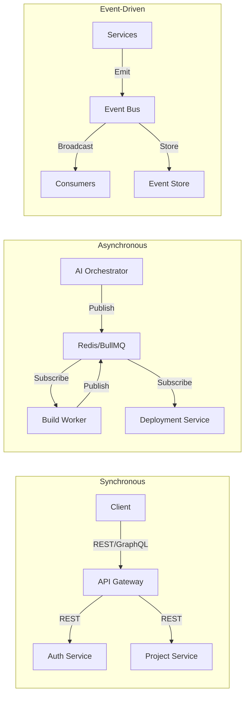

### 3.5.2 Synchronous Communication (REST/GraphQL)

Used for:
- User-facing operations requiring immediate response
- Authentication and authorization
- Data queries with low latency requirements
- Health checks and status endpoints

```typescript
// Service-to-Service REST Communication
interface ServiceClient {
  baseUrl: string;
  timeout: number;
  retries: number;
  circuitBreaker: CircuitBreakerConfig;
}

const serviceRegistry: Record<string, ServiceClient> = {
  auth: {
    baseUrl: process.env.AUTH_SERVICE_URL!,
    timeout: 5000,
    retries: 3,
    circuitBreaker: {
      failureThreshold: 5,
      resetTimeout: 30000,
    },
  },
  project: {
    baseUrl: process.env.PROJECT_SERVICE_URL!,
    timeout: 10000,
    retries: 2,
    circuitBreaker: {
      failureThreshold: 5,
      resetTimeout: 30000,
    },
  },
};

// Circuit breaker pattern implementation
class CircuitBreaker {
  private state: 'CLOSED' | 'OPEN' | 'HALF_OPEN' = 'CLOSED';
  private failures = 0;
  private lastFailure: Date | null = null;

  async execute<T>(operation: () => Promise<T>): Promise<T> {
    if (this.state === 'OPEN') {
      if (this.shouldAttemptReset()) {
        this.state = 'HALF_OPEN';
      } else {
        throw new CircuitOpenError();
      }
    }

    try {
      const result = await operation();
      this.onSuccess();
      return result;
    } catch (error) {
      this.onFailure();
      throw error;
    }
  }
}
```

### 3.5.3 Asynchronous Communication (Message Queue)

Used for:
- Long-running operations (builds, deployments)
- Decoupling services for scalability
- Reliable task processing with retry support
- Rate limiting and load leveling

#### Message Queue Architecture

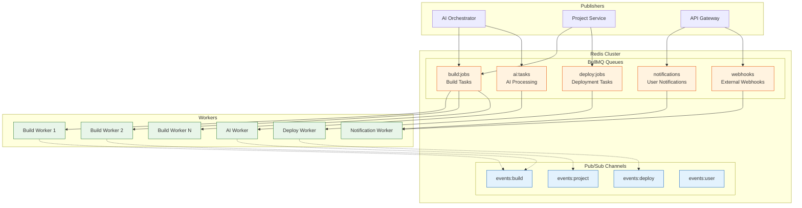

#### Queue Configuration

```typescript
// BullMQ Queue Definitions
interface QueueConfig {
  name: string;
  defaultJobOptions: JobOptions;
  rateLimiter?: RateLimiterOptions;
  concurrency: number;
}

const QUEUE_CONFIGS: Record<string, QueueConfig> = {
  'build:jobs': {
    name: 'build:jobs',
    defaultJobOptions: {
      attempts: 3,
      backoff: {
        type: 'exponential',
        delay: 5000,
      },
      removeOnComplete: {
        age: 3600, // 1 hour
        count: 1000,
      },
      removeOnFail: {
        age: 86400, // 24 hours
      },
    },
    rateLimiter: {
      max: 10,
      duration: 1000, // 10 jobs per second max
    },
    concurrency: 5,
  },

  'deploy:jobs': {
    name: 'deploy:jobs',
    defaultJobOptions: {
      attempts: 2,
      backoff: {
        type: 'fixed',
        delay: 10000,
      },
      timeout: 600000, // 10 minutes
    },
    concurrency: 3,
  },

  'ai:tasks': {
    name: 'ai:tasks',
    defaultJobOptions: {
      attempts: 3,
      backoff: {
        type: 'exponential',
        delay: 2000,
      },
      priority: 1,
    },
    rateLimiter: {
      max: 50,
      duration: 60000, // 50 per minute (LLM rate limiting)
    },
    concurrency: 10,
  },

  'notifications': {
    name: 'notifications',
    defaultJobOptions: {
      attempts: 5,
      backoff: {
        type: 'exponential',
        delay: 1000,
      },
    },
    concurrency: 20,
  },
};

// Job type definitions
interface BuildJob {
  type: 'build';
  payload: {
    projectId: string;
    commitSha: string;
    buildConfig: BuildConfig;
    triggeredBy: string;
    retryCount: number;
    previousErrors?: ParsedError[];
  };
}

interface DeployJob {
  type: 'deploy';
  payload: {
    projectId: string;
    buildId: string;
    environment: 'preview' | 'staging' | 'production';
    deployConfig: DeployConfig;
  };
}

interface AITask {
  type: 'plan' | 'code' | 'review' | 'fix';
  payload: {
    projectId: string;
    context: LLMContext;
    model: string;
    maxTokens: number;
    temperature: number;
  };
}
```

### 3.5.4 Event-Driven Architecture

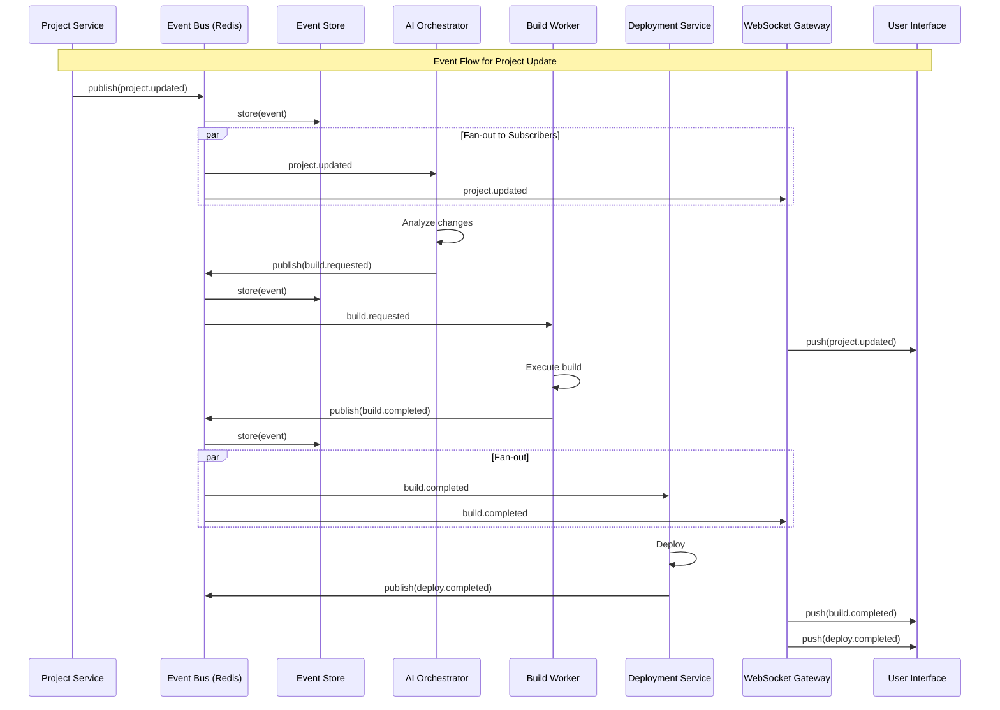

#### Event Definitions

```typescript
// Event type definitions
enum EventType {
  // Project events
  PROJECT_CREATED = 'project.created',
  PROJECT_UPDATED = 'project.updated',
  PROJECT_DELETED = 'project.deleted',
  PROJECT_SETTINGS_CHANGED = 'project.settings.changed',

  // Build events
  BUILD_REQUESTED = 'build.requested',
  BUILD_STARTED = 'build.started',
  BUILD_PROGRESS = 'build.progress',
  BUILD_COMPLETED = 'build.completed',
  BUILD_FAILED = 'build.failed',

  // AI events
  AI_PLANNING_STARTED = 'ai.planning.started',
  AI_PLANNING_COMPLETED = 'ai.planning.completed',
  AI_CODING_STARTED = 'ai.coding.started',
  AI_CODING_COMPLETED = 'ai.coding.completed',
  AI_FIX_APPLIED = 'ai.fix.applied',

  // Deploy events
  DEPLOY_REQUESTED = 'deploy.requested',
  DEPLOY_STARTED = 'deploy.started',
  DEPLOY_COMPLETED = 'deploy.completed',
  DEPLOY_FAILED = 'deploy.failed',
  DEPLOY_ROLLBACK = 'deploy.rollback',

  // User events
  USER_ACTION = 'user.action',
  USER_FEEDBACK = 'user.feedback',
}

interface BaseEvent {
  id: string;
  type: EventType;
  timestamp: Date;
  correlationId: string;  // Trace across services
  causationId?: string;   // Event that caused this event
  source: string;         // Service that emitted
  version: string;        // Event schema version
}

interface BuildCompletedEvent extends BaseEvent {
  type: EventType.BUILD_COMPLETED;
  payload: {
    projectId: string;
    buildId: string;
    imageTag: string;
    duration: number;
    artifacts: string[];
    stats: {
      totalFiles: number;
      bundleSize: number;
      testsPassed: number;
      testsFailed: number;
    };
  };
}

interface BuildFailedEvent extends BaseEvent {
  type: EventType.BUILD_FAILED;
  payload: {
    projectId: string;
    buildId: string;
    errors: ParsedError[];
    logs: string;
    retryCount: number;
    willRetry: boolean;
  };
}

// Event bus implementation
class EventBus {
  private redis: Redis;
  private subscribers: Map<EventType, EventHandler[]> = new Map();

  async publish<T extends BaseEvent>(event: T): Promise<void> {
    const channel = this.getChannel(event.type);

    // Store in event store for replay/audit
    await this.storeEvent(event);

    // Publish to subscribers
    await this.redis.publish(channel, JSON.stringify(event));

    // Metrics
    metrics.eventPublished.inc({ type: event.type, source: event.source });
  }

  async subscribe(eventTypes: EventType[], handler: EventHandler): Promise<void> {
    const subscriber = this.redis.duplicate();

    for (const type of eventTypes) {
      const channel = this.getChannel(type);
      await subscriber.subscribe(channel);

      const handlers = this.subscribers.get(type) || [];
      handlers.push(handler);
      this.subscribers.set(type, handlers);
    }

    subscriber.on('message', async (channel, message) => {
      const event = JSON.parse(message) as BaseEvent;
      const handlers = this.subscribers.get(event.type) || [];

      for (const handler of handlers) {
        try {
          await handler(event);
        } catch (error) {
          console.error(`Event handler error for ${event.type}:`, error);
          // Dead letter queue for failed events
          await this.publishToDeadLetter(event, error);
        }
      }
    });
  }

  private getChannel(type: EventType): string {
    const [domain] = type.split('.');
    return `events:${domain}`;
  }
}
```

### 3.5.5 Communication Pattern Decision Matrix

| Scenario | Pattern | Protocol | Why |
|----------|---------|----------|-----|
| User authentication | Sync | REST | Immediate response required |
| Project CRUD | Sync | REST/GraphQL | User expects immediate feedback |
| Build trigger | Async | BullMQ | Long-running, needs reliability |
| Build status update | Event | Pub/Sub | Multiple consumers need notification |
| AI code generation | Async | BullMQ | Long-running, rate-limited |
| Real-time progress | Event | WebSocket | User needs live updates |
| Deployment | Async | BullMQ | Complex workflow, needs orchestration |
| Inter-service data fetch | Sync | gRPC | Low latency, typed contracts |
| Audit logging | Event | Event Store | Compliance, replay capability |
| Metrics collection | Async | Push | Non-blocking, aggregatable |

### 3.5.6 Service Mesh Configuration (Optional)

For production deployments, a service mesh provides advanced traffic management:

```yaml
# Istio VirtualService for canary deployments
apiVersion: networking.istio.io/v1beta1
kind: VirtualService
metadata:
  name: ai-orchestrator
spec:
  hosts:
    - ai-orchestrator
  http:
    - match:
        - headers:
            x-canary:
              exact: "true"
      route:
        - destination:
            host: ai-orchestrator
            subset: canary
          weight: 100
    - route:
        - destination:
            host: ai-orchestrator
            subset: stable
          weight: 95
        - destination:
            host: ai-orchestrator
            subset: canary
          weight: 5

---
# DestinationRule for circuit breaking
apiVersion: networking.istio.io/v1beta1
kind: DestinationRule
metadata:
  name: build-worker
spec:
  host: build-worker
  trafficPolicy:
    connectionPool:
      tcp:
        maxConnections: 100
      http:
        h2UpgradePolicy: UPGRADE
        http1MaxPendingRequests: 100
        http2MaxRequests: 1000
    outlierDetection:
      consecutive5xxErrors: 5
      interval: 30s
      baseEjectionTime: 30s
      maxEjectionPercent: 50
```

---

## 3.6 Data Flow Summary

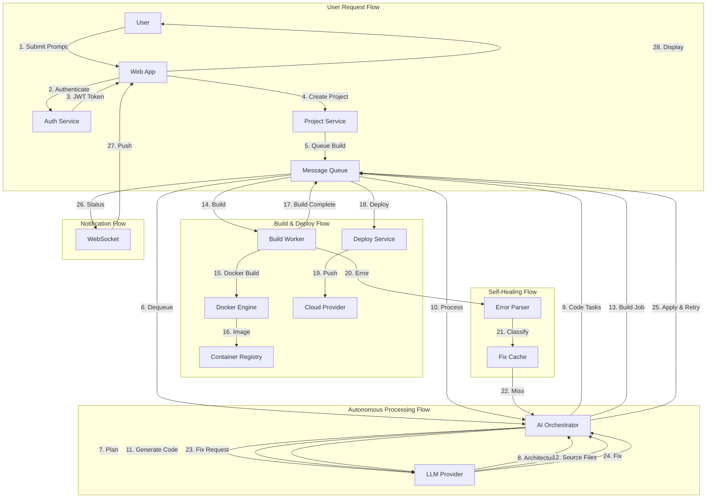

---

## 3.7 Architecture Decision Records (ADRs)

### ADR-001: Microservices over Monolith
**Status:** Accepted
**Context:** Need to scale AI processing independently from web serving
**Decision:** Adopt microservices architecture with BullMQ for async communication
**Consequences:** Increased operational complexity, better scalability and fault isolation

### ADR-002: BullMQ over RabbitMQ/Kafka
**Status:** Accepted
**Context:** Need reliable job queue with Redis already in stack
**Decision:** Use BullMQ for job queues, Redis Pub/Sub for events
**Consequences:** Simpler stack, good enough throughput, may need Kafka for >100K events/sec

### ADR-003: pgvector for Fix Caching
**Status:** Accepted
**Context:** Need semantic search for similar error fixes
**Decision:** Use PostgreSQL with pgvector extension
**Consequences:** Single database for relational + vector, good enough for initial scale

### ADR-004: Docker-based Builds
**Status:** Accepted
**Context:** Need isolated, reproducible builds
**Decision:** Docker with BuildKit for all project builds
**Consequences:** Consistent environments, slightly slower than native builds

---

*This architecture is designed to evolve. Components can be swapped (e.g., Kafka for Redis at scale) without affecting the overall system design.*
